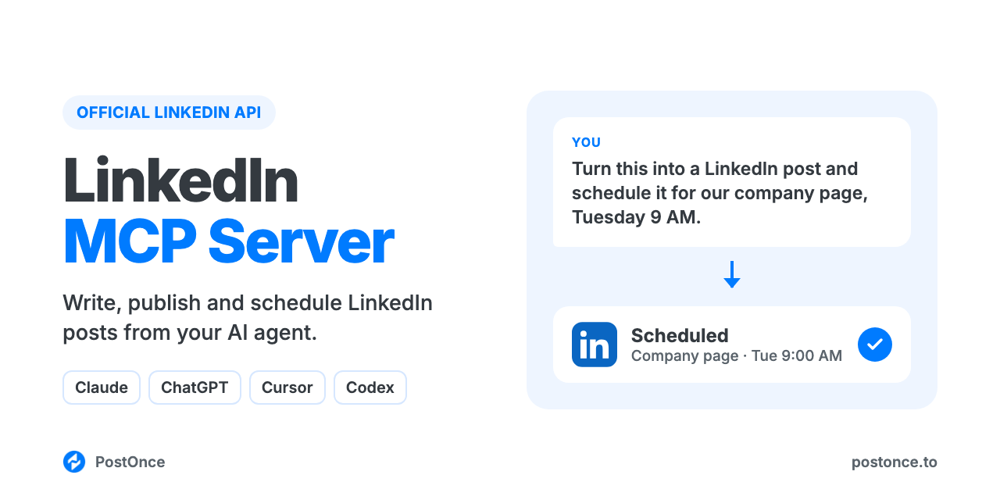

<p align="center"></p>

# LinkedIn MCP Server

LinkedIn MCP server for Claude, ChatGPT, Cursor and Codex. Your AI agent can write, publish and schedule LinkedIn posts on your profile or company page through LinkedIn's official API. There's no scraping, no browser automation and no LinkedIn developer app to set up.

It runs on [PostOnce](https://postonce.to)'s hosted MCP server and comes with LinkedIn writing skills, so your agent knows what a good LinkedIn post looks like before it posts one.

```
You:    Turn this week's product update into a LinkedIn post for our company page
        and schedule it for Tuesday 9am.
Claude: Drafted it with the linkedin-post-writer skill. Here's the post; the
        first line names the problem, the link goes in the first comment.
        Scheduled on PostOnce for Tue 9:00 on "Acme" (company page).
```

## What you can do

| Ask your agent to | How it works |
| --- | --- |
| Publish a text post now | `create_post` on your connected LinkedIn account |
| Schedule a post for later | `create_post` with `publish_at` |
| Post images (up to 20) or one video (up to 30 minutes) | `create_upload_url`, upload, then `create_post` with `media` |
| Post to your profile, or to a company page you admin | Pick the account from `list_accounts`. Company pages are connected from the PostOnce dashboard |
| Save a draft to finish later | `create_draft` |
| Check whether a post went out, and get its URL | `get_post` |
| Change or cancel a scheduled post | `update_post`, `cancel_post` |
| Post the same thing to LinkedIn and other platforms | Add more targets to `create_post` (Instagram, TikTok, YouTube, X, Threads, Facebook, Pinterest, Bluesky) |

Not supported: reading your feed, searching people, sending messages or connection requests, and LinkedIn document (PDF) posts. This server publishes; it doesn't browse LinkedIn for you.

## Setup (about a minute)

You need a [PostOnce account](https://postonce.to) (free for 7 days, no card) with your LinkedIn profile or page connected.

**Claude (claude.ai and desktop) and ChatGPT:** add a custom connector with the URL below and sign in with PostOnce. No API key.

```
https://postonce.to/mcp
```

Step-by-step: [Claude](https://postonce.to/integrations/claude) · [ChatGPT](https://postonce.to/integrations/chatgpt)

**Claude Code, Codex and Cursor:** install this repo as a plugin. It adds the MCP connection and the skills below together. Create an API key in [PostOnce preferences](https://postonce.to/dashboard/preferences) and give it to your client as the `POSTONCE_API_KEY` environment variable. Never paste the key into chat.

```bash
# Claude Code
claude plugin marketplace add postoncehq/plugins
claude plugin install linkedin-mcp@postoncehq
```

Step-by-step: [Claude Code](https://postonce.to/integrations/claude-code) · [Codex](https://postonce.to/integrations/codex) · [Cursor](https://postonce.to/integrations/cursor)

**Any other MCP client:** point it at `https://postonce.to/mcp` (Streamable HTTP) with the header `Authorization: Bearer <your PostOnce API key>`.

## Skills included

| Skill | What it does |
| --- | --- |
| [`linkedin-post-writer`](skills/linkedin-post-writer/SKILL.md) | Writes LinkedIn posts that get read: a first line that stops the scroll, short lines, one idea, a real ending. Uses hook patterns taken from high-performing LinkedIn posts. |
| [`linkedin-image-carousel`](skills/linkedin-image-carousel/SKILL.md) | Plans a multi-image post (up to 20 images) slide by slide, with the caption to go with it. |
| [`linkedin-text-formatter`](skills/linkedin-text-formatter/SKILL.md) | Formats a post for the feed: line breaks, bullets, optional Unicode bold and italic (with the accessibility caveat), and a check that the hook lands before "see more". Stays under the 3,000-character limit. |
| [`linkedin-headline-generator`](skills/linkedin-headline-generator/SKILL.md) | Writes profile headline options up to 220 characters, built on role, outcome and search keywords. You paste the one you pick into LinkedIn. |
| [`linkedin-profile-optimizer`](skills/linkedin-profile-optimizer/SKILL.md) | Rewrites your About section, Featured items, banner copy and experience bullets. You paste them into your profile. |
| [`linkedin-content-calendar`](skills/linkedin-content-calendar/SKILL.md) | Plans 1–4 weeks of posts from your goals or a source like a blog post or transcript, drafts each one and schedules them on approval. |
| [`postonce`](skills/postonce/SKILL.md) | Publishing workflow: pick the right account, upload media, schedule, and confirm the post actually went live. |

## FAQ

**Does LinkedIn have an official MCP server?**
No. LinkedIn offers REST APIs but no MCP server. This server uses LinkedIn's official posting API through PostOnce.

**Is it safe for my LinkedIn account?**
Yes. Posts go through LinkedIn's official API with the permissions you grant when you connect. Many LinkedIn MCP servers on GitHub drive a logged-in browser session instead, which LinkedIn's User Agreement doesn't allow and which can get accounts restricted.

**Can Claude post to LinkedIn?**
Yes, once it's connected to an MCP server that can publish, like this one. Claude writes the post, then calls `create_post`.

**Can it post to a LinkedIn company page?**
Yes, to pages you're an admin of. Connect the page from the [PostOnce dashboard](https://postonce.to/dashboard/accounts); connecting from your agent links your personal profile only. Once the page is connected, your agent can post to it.

**Do I need a LinkedIn developer app or API approval?**
No. PostOnce holds the LinkedIn API access; you just connect your account.

**Is it free?**
The skills and this repo are free and MIT-licensed. Publishing runs through a PostOnce account, which you can try free for 7 days without entering a card. After that, see [pricing](https://postonce.to/pricing).

## Other platforms

The same connection posts everywhere PostOnce supports. Platform repos with their own skills:
[Instagram MCP](https://github.com/postoncehq/instagram-mcp) · [TikTok MCP](https://github.com/postoncehq/tiktok-mcp) · [YouTube MCP](https://github.com/postoncehq/youtube-mcp) · [Facebook MCP](https://github.com/postoncehq/facebook-mcp) · [X (Twitter) MCP](https://github.com/postoncehq/x-mcp) · [Threads MCP](https://github.com/postoncehq/threads-mcp) · [Bluesky MCP](https://github.com/postoncehq/bluesky-mcp) · [Pinterest MCP](https://github.com/postoncehq/pinterest-mcp)

## License

MIT. See [LICENSE](LICENSE).
